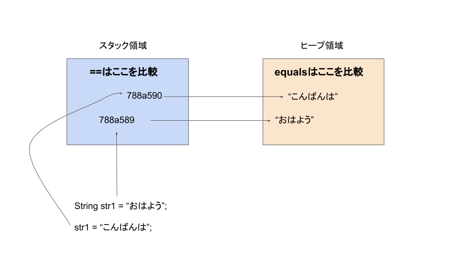

# javaにおける参照渡し、参照の値渡し、値渡しまとめ

何回調べても細かい部分の知識があやふやになるので一旦整理。

## javaの参照型、プリミティブ型

まず、javaの参照型、プリミティブ型について整理。

### プリミティブ型

```java
boolean (1bit)
byte (8bit)
char (16bit)
short (16bit)
int (32bit)
float (32bit)
long (64bit)
double (64bit)
```

プリミティブは、上記の型のもの。全て変数のサイズ(bit)が決まっている。
規定のサイズを超える値を格納することはできない。

### 参照型

参照型とは、例えば、List系、ラッパークラス、配列など。参照型の特徴は、
変数に格納されているのは実際の値ではなく、値がどのメモリのどこに格納されているかを示す値。

メモリには、スタック領域とヒープ領域の２つある。

スタック領域には、プリミティブ値、参照値(例：Array@788だったら788)がはいっており、ヒープ領域にはオブジェクトのインスタンス、実際の値や、メソッドが格納されます。

あるメソッドの中で宣言された変数（ローカル変数）は全てスタック領域に格納されます。


## 変数の代入

次に理解する必要のある内容は変数の代入。


変数の代入とは、「ある変数が持っている値を別の変数に渡すこと」。

自分自身の値をコピーするイメージ。

例は、passValueパッケージ配下に記述。

## ==とequalsの違い


上記図のとおり。
そのため、参照型の変数を比較したいときは、==だと、参照値を比較することになってしまうため、実際に入っている値(ヒープ領域にある値)を比較したい場合は、equalsを使う。

逆に、プリミティブな値は、equalsは使えない。プリミティブ値は常にスタック領域に格納されるため、==を使う形となる。

例は、checkEqualパッケージ配下に記述。

## String型の扱い

定数の場合、明示的にfinalなどをつけたりするが、javaでは仕様としてイミュータブルな型が存在する。それがString型。


String型は参照型なので、スタック領域に参照値、ヒープ領域に実際の値が格納される。


この時、str1に別の文字列"こんばんは"を代入しようとすると、String型はイミュータブルであるため、新たに別の参照値をとる形となる。



そして、String型は実際の値が同じであれば、再利用されます。
つまり、変数に値を代入する時に、もしその値がすでに存在していれば、その参照値が使われます。

なお、new演算子をつけた場合、必ず新しい参照を作成するという意味になる。

一つ、注意点としては、String型の変数を大量に書き換えるような処理の場合、
メモリが圧迫される。という問題がある。
Stringに他の文字列を代入するときは、その値を書き換えるのではなく、新しい参照を作成する。そのため、何十万件という処理をStringで書き換える場合、メモリがいっぱいになって落ちるということが起きる場合もある。

例はstringSampleパッケージ配下に記述。

## Javaの参照値について

Javaに参照渡しは存在しない。参照の値渡しが存在する。

### 値渡しと参照渡しの違いについて(java関係なく全般的な話)

そもそも、値渡し、参照渡しの渡しとは、ファンクションなどに変数(値型　or 参照型)を渡すときの話。

#### 値渡しの場合

ファンクションを呼び出すときに、プリミティブな値を伝えてるだけなので、ファンクションを呼び出した後でも、値は変わらない。

#### 参照渡しの場合

参照渡しとは、。

javaでは参照渡しは存在しなくて、正確には参照値の値渡しであるが、便宜上、javaの記述を使って説明。

参照型の場合、参照値を渡すため、main関数で呼び出した時には、参照型変数の実際の値は変わっていることが確認できる。

サンプルはpassByValueOrReferenceToFunctionパッケージ配下に置いている。


ただし、実際にjavaでは、参照型の変数を渡すときには、参照渡しではなく、参照値の値渡しが行われている。

とりあえず、javaに関しては、プリミティブだろうが、参照型だろうが、全て値渡し。
参照型も、参照値を値渡ししているだけ。


### 参照の値渡しとは

PassByValueOrReferenceToFunctionパッケージ配下の記述を参考。

もし、本当に参照渡しだとしたら、`PassByReferenceValueToFunction`では、
mainメソッド内で出力しているlistも書き換わってないとおかしい。

## 参考

https://qiita.com/newta/items/ccf9116909dc61ed7123

https://freelance-jak.com/technology/java/998/

https://qiita.com/mdstoy/items/2ef4ada6f88341466783